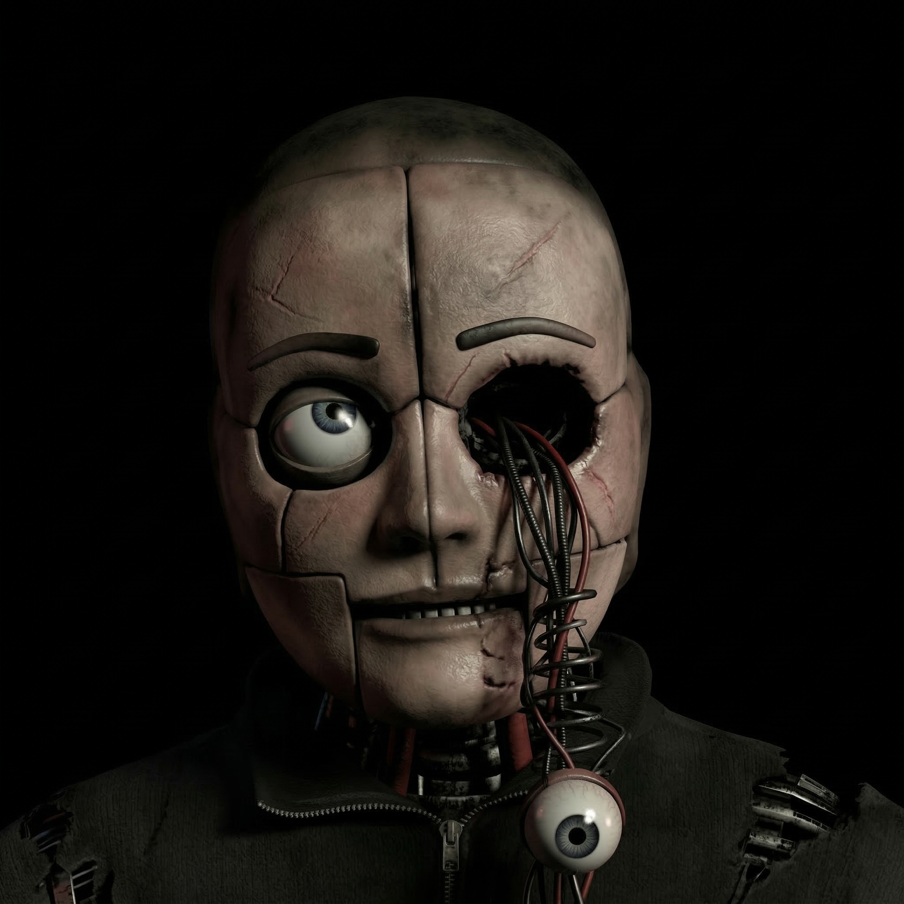
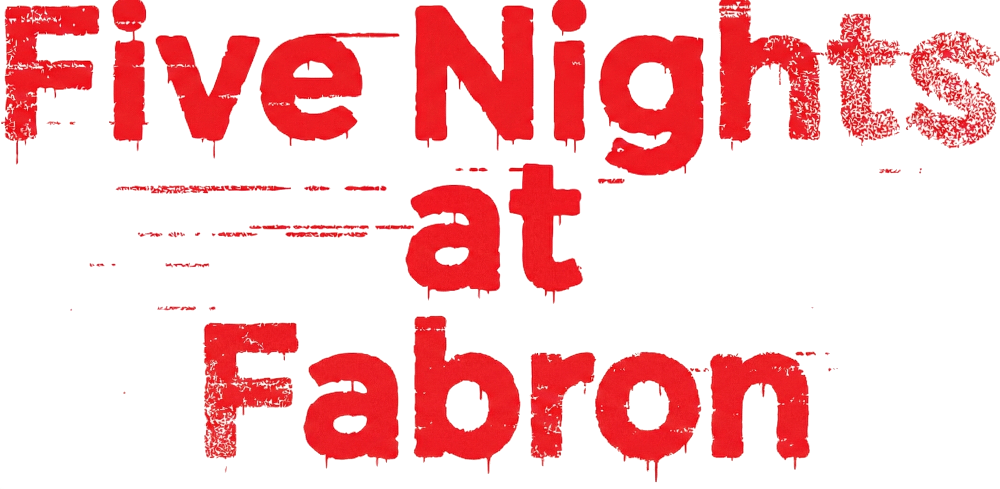
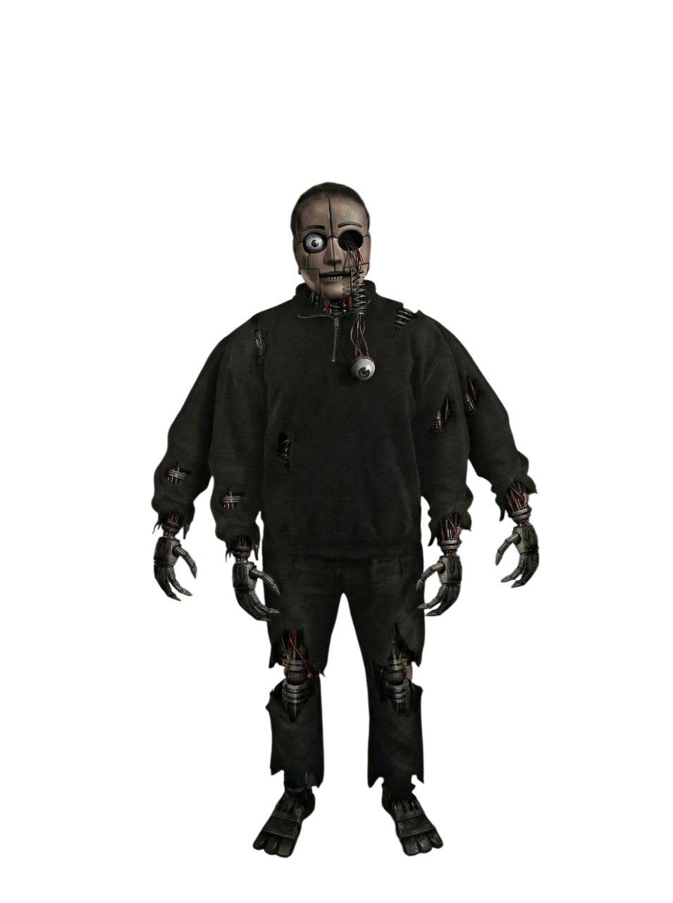
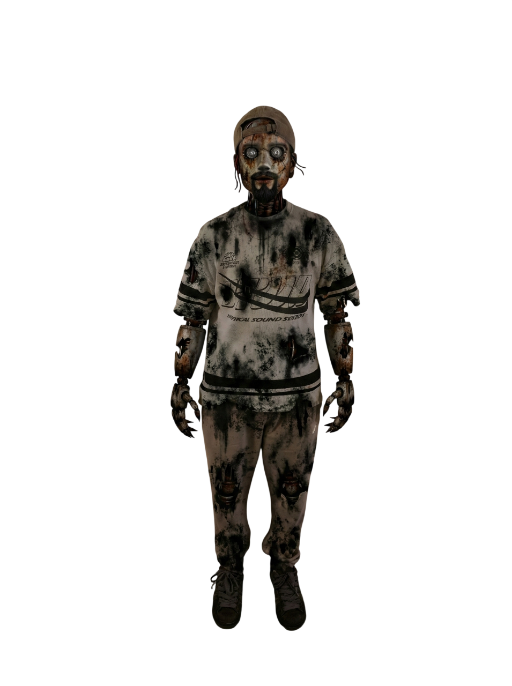
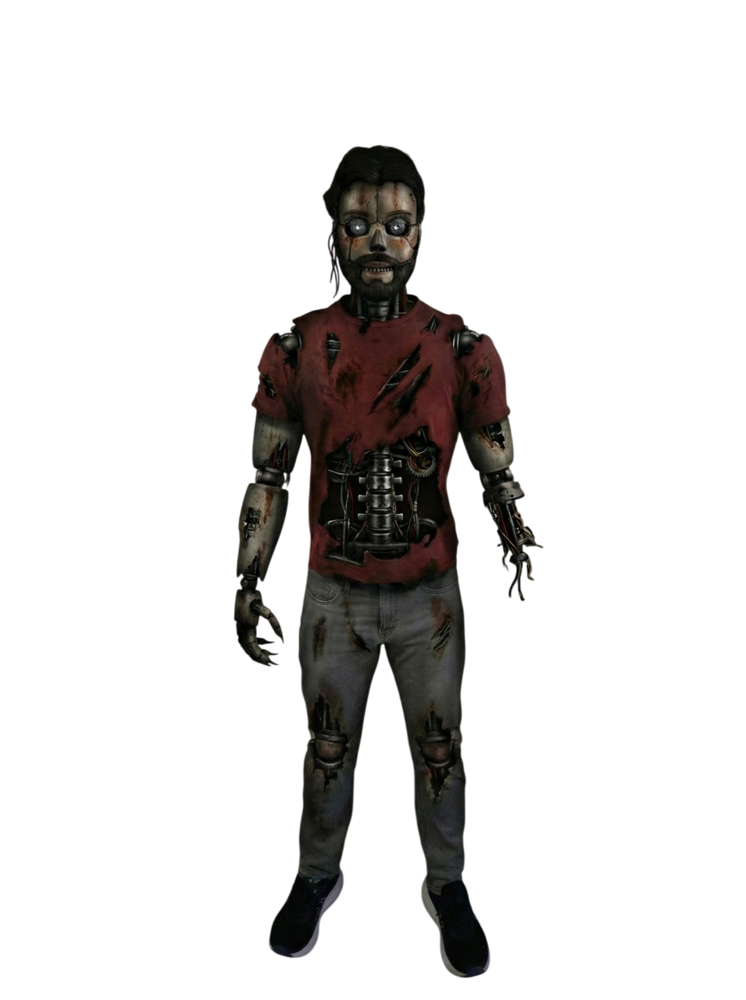
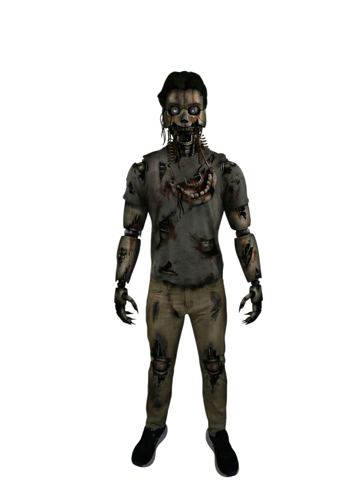
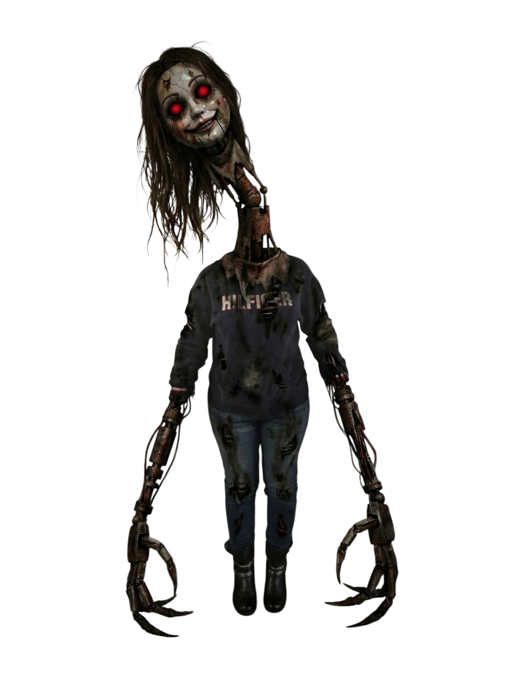

<div align="center">

  <!-- Logo du jeu -->
  

  # 🐻 FIVE NIGHTS AT FABRON 🔦

  **Un jeu de survie horrifique en Point-and-Click basé sur une architecture Client-Serveur.**

  [](https://www.oracle.com/java/technologies/javase/jdk17-archive-downloads.html)
  [](https://spring.io/projects/spring-boot)
  []()
  []()
  []()

  <br/>

  <!-- Logos institutionnels -->
  <a href="https://univ-cotedazur.fr" target="_blank">
    
  </a>
  &nbsp;&nbsp;&nbsp;
  <a href="https://iut.univ-cotedazur.fr" target="_blank">
    
  </a>

  <sub><i>Projet d'équipe — Architecture Logicielle · BUT Informatique 2ᵉ année</i></sub>

</div>

---

<div align="center">
  
</div>

---

## 📻 MESSAGE DE LA DIRECTION *(Lore)*

> *"Bonjour, bonjour ? Uh, bienvenue sur le campus de Fabron pour votre nouveau poste d'agent de sécurité de nuit. Félicitations ! Votre rôle est simple : surveiller la salle des serveurs et vous assurer que tout reste en ordre jusqu'à 6h du matin.*
>
> *Vous avez à votre disposition un réseau de caméras, deux portes blindées, et une fenêtre. Oh, au fait, la climatisation est en panne. L'utilisation des caméras et la fermeture des portes feront grimper la température de la pièce. Si vous atteignez 100%, le disjoncteur sautera. Croyez-moi, vous ne voulez pas être plongé dans le noir.*
>
> *Il se peut que certaines... mascottes — **Bluebear**, **Redbear**, **Burncap** et **Oneeyed** — se promènent la nuit. Elles sont programmées pour rejoindre les zones d'activité. Si elles s'approchent un peu trop de votre bureau, fermez simplement la porte. N'oubliez pas de garder un œil sur vos écrans, gérez votre température, et tout ira bien.*
>
> *Bonne nuit."*

<div align="center">
  
</div>

---

## 🎮 INSPIRATION

Ce projet est un **fan-game** librement inspiré de la franchise **Five Nights at Freddy's** créée par **Scott Cawthon** (2014).

<div align="center">
  <a href="https://en.wikipedia.org/wiki/Five_Nights_at_Freddy%27s" target="_blank">
    
  </a>
  <br/>
  <sub>
    Inspiré de <a href="https://en.wikipedia.org/wiki/Five_Nights_at_Freddy%27s"><b>Five Nights at Freddy's</b></a> © Scott Cawthon — <i>Toute ressemblance avec des animatroniques existants... est totalement assumée.</i>
  </sub>
</div>

> ⚠️ *Five Nights at Fabron est un projet étudiant non-commercial, réalisé dans un cadre pédagogique. Toute la direction artistique, les personnages et l'univers sont originaux et spécifiques à ce projet.*

---

## 📋 CONFORMITÉ AU CAHIER DES CHARGES

> 📄 Le cahier des charges complet est disponible ici : [`docs/Mini-projet___Jeu_Vidéo_Web_Client_serveur.pdf`](./docs/Mini-projet___Jeu_Vidéo_Web_Client_serveur.pdf)

### ✅ Fonctionnalités minimales

| Exigence | Statut | Détail |
|---|:---:|---|
| API REST — Gestion des joueurs | ✅ | `POST /api/auth/register` · `POST /api/auth/login` |
| API REST — Création & gestion des parties | ✅ | `POST /api/game/start` · `GET /api/game/state` · `POST /api/game/action` |
| API REST — Sauvegarde & récupération des scores | ✅ | `GET /api/scores/leaderboard` · `ScoreRepository` JPA |
| Validation des règles côté serveur | ✅ | Logique IA & collisions dans `GameEngineService` (Server-Authoritative) |
| Persistance des données (BDD) | ✅ | MySQL en production · H2 in-memory pour les tests |
| Interface web interactive | ✅ | `index.html` + `main.js` + `style.css` — Vanilla JS |
| Appels REST (Fetch API) | ✅ | Polling toutes les secondes sur `/api/game/state` |
| Affichage dynamique (scores, états de jeu) | ✅ | Mise à jour DOM en temps réel, gestion des jumpscares |
| Gestion des événements utilisateur | ✅ | Clics portes/fenêtre, caméras, interactions bureau |
| Frontend et backend séparés | ✅ | Dossiers `frontend/` et `backend/` distincts |
| Échanges au format JSON | ✅ | Tous les endpoints retournent/consomment du JSON |
| Bonnes pratiques REST (GET/POST/PUT/DELETE) | ✅ | Verbes HTTP respectés sur l'ensemble de l'API |

### 🎁 Bonus réalisés

| Bonus | Statut | Détail |
|---|:---:|---|
| Authentification JWT | ✅ | `JwtUtil` + Spring Security Stateless — token Bearer |
| Classement global (Leaderboard) | ✅ | `ScoreController` · endpoint `/api/scores/leaderboard` |
| Design graphique amélioré | ✅ | Effets CRT, vignettage, scanlines, animations CSS, jumpscares vidéo |
| WebSocket temps réel | ❌ | Non implémenté — remplacé par polling REST (1s) |
| Documentation (Javadoc & README) | ✅ | Code entièrement documenté et README complet |


### 🗄️ Script de base de données

Le script de création et d'initialisation de la base de données MySQL est disponible ici :

[`backend/sql/init_database.sql`](./backend/sql/init_database.sql)

---

## ⚙️ ARCHITECTURE TECHNIQUE & TECHNOLOGIES

Ce projet repose sur une architecture **N-Tiers** séparant strictement le client lourd (navigateur) du serveur d'application (API REST).

> 🔒 **Server-Authoritative** — Le front-end est une pure interface d'affichage. Toute la logique d'IA, de collision et de temporisation est calculée côté serveur, ce qui rend la triche impossible.

### 🛠️ Stack Backend

| Composant | Technologie |
|---|---|
| Langage | Java 17 |
| Framework | Spring Boot 3.2.4 |
| Sécurité | Spring Security + JWT (Auth0) + BCrypt |
| Persistance | Spring Data JPA / Hibernate |
| Base de données | MySQL *(prod)* · H2 in-memory *(tests)* |
| Moteur de jeu | Thread-safe via `ConcurrentHashMap` + Ticks serveur |

### 🖥️ Stack Frontend

| Composant | Technologie |
|---|---|
| Langage | HTML5 · CSS3 · JavaScript ES6 (Vanilla) |
| Communication | Fetch API — polling `/api/game/state` toutes les secondes |
| Rendu | Manipulation DOM · CSS Animations (jumpscares, vignettage, scanlines CRT) |

---

## 🚀 INSTALLATION ET DÉMARRAGE

### 1. Prérequis

L'environnement de développement recommandé est **Visual Studio Code (VS Code)**.

**Logiciels requis :**
- ☕ **JDK 17** — [Télécharger](https://www.oracle.com/java/technologies/javase/jdk17-archive-downloads.html)
- 🗄️ **MySQL** — ou accès VPN au réseau de l'université si la base est distante
- Maven est embarqué via le wrapper `mvnw`, aucune installation manuelle requise

**Extensions VS Code recommandées :**

| Extension | Éditeur | Rôle |
|---|---|---|
| Extension Pack for Java | Microsoft | Autocomplétion & support Java 17 |
| Spring Boot Extension Pack | VMware | Gestion du contexte Spring |
| Live Server | Ritwick Dey | Rechargement automatique du frontend |

---

### 2. Démarrer le Backend *(Spring Boot)*

```bash
# Se placer dans le dossier backend
cd backend/

# Linux / macOS — rendre le wrapper exécutable
chmod +x mvnw
./mvnw spring-boot:run

# Windows
mvnw.cmd spring-boot:run
```

> ⚠️ Si vous utilisez la base de données de l'université, **assurez-vous que votre VPN est actif** avant de lancer le serveur.

✅ Le serveur API démarre sur le port **`8080`** — [`http://localhost:8080`](http://localhost:8080)

---

### 3. Démarrer le Frontend *(Client)*

1. Ouvrez le dossier `frontend/` dans VS Code.
2. Faites un clic droit sur `index.html` → **"Open with Live Server"**.
3. Le jeu s'ouvre dans votre navigateur (généralement sur le port **`5500`**).
4. Créez un compte, connectez-vous… et tentez de survivre jusqu'à 6h du matin. 🕕

---

## 🧪 TESTS AUTOMATISÉS

Le projet utilise **JUnit 5**, **Mockito** et **H2 Database** pour garantir la robustesse du code de production. La base H2 in-memory crée les tables à la volée pendant les tests, sans jamais toucher la base MySQL de production.

### Lancer la suite de tests

```bash
cd backend/
./mvnw test
```

### Couverture actuelle

| Classe de test | Type | Périmètre couvert |
|---|---|---|
| `AuthControllerTest` | Unitaire (Mockito) | Inscription, connexion, gestion JWT, cas d'erreur |
| `JwtUtilTest` | Unitaire | Génération, validation et expiration des tokens |
| `SecurityConfigTest` | Intégration | Filtres HTTP, routes publiques vs. protégées |
| `PlayerRepositoryTest` | Intégration JPA (`@DataJpaTest`) | Contrainte d'unicité username, requêtes H2 |
| `GameEngineServiceTest` | Unitaire (Mockito) | Thread-safety, collisions d'animatroniques, logique de ticks |
| `ScoreControllerTest` | Unitaire (Mockito) | Leaderboard, mapping DTO, cas limites |

---

## 🗃️ ARBORESCENCE DU PROJET

```
Five-Nights-at-Fabron/
│
├── backend/                          # 🖥️  Serveur Spring Boot
│   ├── sql/
│   │   └── init_database.sql         # Script de création de la base de données MySQL
│   ├── src/
│   │   ├── main/java/.../
│   │   │   ├── auth/                 # Inscription, connexion, JWT
│   │   │   ├── config/               # CORS, Spring Security
│   │   │   ├── game/                 # Moteur de jeu : Animatroniques, GameState
│   │   │   ├── player/               # Entité Player & Repository JPA
│   │   │   └── score/                # Leaderboard & ScoreRepository
│   │   └── test/java/.../            # Tests unitaires & intégration
│   └── pom.xml                       # Dépendances Maven
│
├── docs/
│   └── Mini-projet___Jeu_Vidéo_Web_Client_serveur.pdf  # 📋 Cahier des charges
│
├── frontend/                         # 🌐  Client Web
│   ├── assets/                       # Médias : images, sons, vidéos
│   ├── img/
│   │   ├── cameras/                  # Visuels des 11 caméras (états vide/occupé)
│   │   ├── jumpscares/               # Images de jumpscare par animatronique
│   │   └── office/                   # Bureau du gardien (desk + window)
│   ├── sound_effect/                 # Musiques, ambiances, SFX
│   ├── index.html                    # Point d'entrée de l'application
│   ├── style.css                     # Animations CRT, vignettage, design global
│   └── main.js                       # Logique cliente & appels API REST
│
└── README.md                         # 📄  Cette documentation
```

---

## 👥 ÉQUIPE DE DÉVELOPPEMENT

<div align="center">

<table>
  <thead>
    <tr>
      <th align="center" width="170">Développeur</th>
      <th align="left">Rôle &amp; Contributions</th>
      <th align="center" width="140">Son animatronique</th>
    </tr>
  </thead>
  <tbody>
    <tr>
      <td align="center">
        <b>🧠 Hamza</b><br/>
        <b>KARROUCHI</b>
      </td>
      <td>Logique fonctionnelle du jeu, équilibrage des ressources (audio &amp; visuels), qualité du code &amp; refactoring (Clean Code)</td>
      <td align="center">
        <br/>
        <sub><b>👁️ Oneeyed</b></sub>
      </td>
    </tr>
    <tr>
      <td align="center">
        <b>🏗️ Nathan</b><br/>
        <b>LASSAUNIÈRE</b>
      </td>
      <td>Architecture globale du projet, développement backend complet (Spring Boot · API REST · JWT · Spring Security · Moteur de jeu)</td>
      <td align="center">
        <br/>
        <sub><b>🔥 Burncap</b></sub>
      </td>
    </tr>
    <tr>
      <td align="center">
        <b>🎨 Damien</b><br/>
        <b>LE DAIN</b>
      </td>
      <td>Développement frontend (UI/UX, animations CSS, jumpscares), base de données MySQL &amp; gestion du dépôt Git</td>
      <td align="center">
        <br/>
        <sub><b>🐻 Redbear</b></sub>
      </td>
    </tr>
  </tbody>
</table>

</div>

---

## 🎭 REMERCIEMENTS SPÉCIAUX

### 🐾 Les modèles des animatroniques

Un grand merci à ceux qui ont accepté de prêter leur image — et leur dignité — pour incarner les créatures qui hantent les couloirs du campus la nuit.

<div align="center">

<table>
  <tbody>
    <tr>
      <td align="center" width="260">
        <br/><br/>
        <b>🐻 Bluebear</b><br/>
        <sub>Incarné par</sub><br/>
        <b>Damien NOUVELLON</b><br/>
        <sub><i>"Merci d'avoir accepté d'être le monstre le plus chelou du jeu."</i></sub>
      </td>
      <td align="center" width="260">
  <br/><br/>
  <b>☠️ G̸̡͓̻͊̑̕o̷̧͚͔͑̀͝l̵̡̛͉̰̑̿d̴̨͙͓͐̀̕ȇ̷̢͚͙̓͝n̸̡̛͓͔̒̿F̵̨̧͙̓̀͝a̷̡͚͓͊̑͠b̸̨̛͙̻̕͝r̷̡͓͔͑̀͠o̵̧͚͙͊̓͝n̸̡̛͓̻̒͝ ☠️</b><br/>
  <sub>I̷̛͓n̸͙̒c̵̛͚a̷͓͊r̸͔̀n̵͙̑é̷͚e̸͓͝ p̵̛͙a̷͚͊r̸͓̀</sub><br/>
  <b>S̵̡̢̛͎͉̯̑̿͐T̵̡̛͚͙̀̓̕A̷̡̛̳͇̻͑̚͝C̵̡̛͚̩͙̈́̓͝Y̷̨̛͍̺͓̒̿͠&nbsp;D̷̨̛͓͙̓̀̕Ö̵̡̢͚͙́̓͝D̷̢̨̛̻̑̕͝Ę̷̢͙͎̑̓̕͝</b><br/>
  <sub><code>// [̴̧E̵͙R̸͓R̷͚O̵͔R̸͙]̴͓ :  r̵͊e̸͝c̷̀ȏ̵n̸͝n̷̛u̵͊e̸͝ —̴ f̵i̸c̷h̵i̸e̷r̵ c̸o̷r̵r̸o̵m̸p̵u̸ \\</code></sub><br/>
  <sub><i>// m̸̛͓e̷͚͊r̸͓̀c̵̛͙î̷͚ ̸͓d̵̛͙'̸͓a̷͚͊v̵͙͝o̸͓͊i̷͚͝r̵̛͙ ̸͓p̷͚̀r̵͙͊ê̸͓t̷͚͠é̵͙ ̸͓t̷̛͚o̵͙͊n̸͓͝ ̷͚v̵̛͙i̸͓͝s̷͚͠a̵̛͙g̸͓͊e̷͚͝ ̵͙p̸͓̀o̷͚͠ȗ̵͙r̸͓͝ ̷͚ǘ̵͙n̸͓͝ ̷̛͚a̵͙͊n̸͓͝i̷͚͊m̵̛͙a̸͓͝t̷͚͠r̵͙͊o̸͓͝n̷͚͊i̵̛͙c̸͓͝ ̷͚q̵͙͊u̸͓͝e̷͚͠ ̵̛͙p̸͓͝e̷͚͊r̵͙̀s̸͓͠o̷͚͊n̵̛͙n̸͓͝e̷͚͠ ̵͙n̸͓͊'̷͚͝a̵̛͙ ̸͓v̷͚͊r̵͙͝a̸͓͊i̷͚͝m̵̛͙e̸͓͝n̷͚͠t̵͙͊ ̸͓v̷̛͚u̵͙͊ \\</i></sub>
</td>
    </tr>
  </tbody>
</table>

> *⚠️ Aucun étudiant n'a été blessé lors du tournage. Enfin… pas physiquement.*

</div>

---

### 🎮 Merci aux testeurs de l'IUT

Un immense merci à nos amis de l'**IUT Côte d'Azur** qui ont accepté de jouer, de se faire jumpscarer à des heures indécentes, et de nous remonter bugs, suggestions et retours précieux tout au long du développement.

Votre patience et vos retours ont directement contribué à l'équilibrage du jeu et à l'amélioration de l'expérience globale. On vous devait bien cette mention. 🙏

> *Vous savez qui vous êtes. Merci — et désolé pour les insomnies.*

---

<div align="center">
  <br/>
  <i>Développé avec sueurs froides et caféine excessive dans le cadre d'un projet d'équipe — Architecture Logicielle · BUT Informatique 2ᵉ année · Université Côte d'Azur, Nice.</i>
  <br/><br/>
  <a href="https://univ-cotedazur.fr" target="_blank">
    
  </a>
  &nbsp;&nbsp;
  <a href="https://iut.univ-cotedazur.fr" target="_blank">
    
  </a>
  <br/><br/>
  
</div>